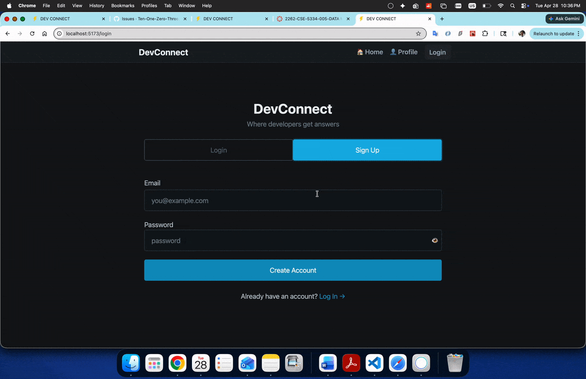
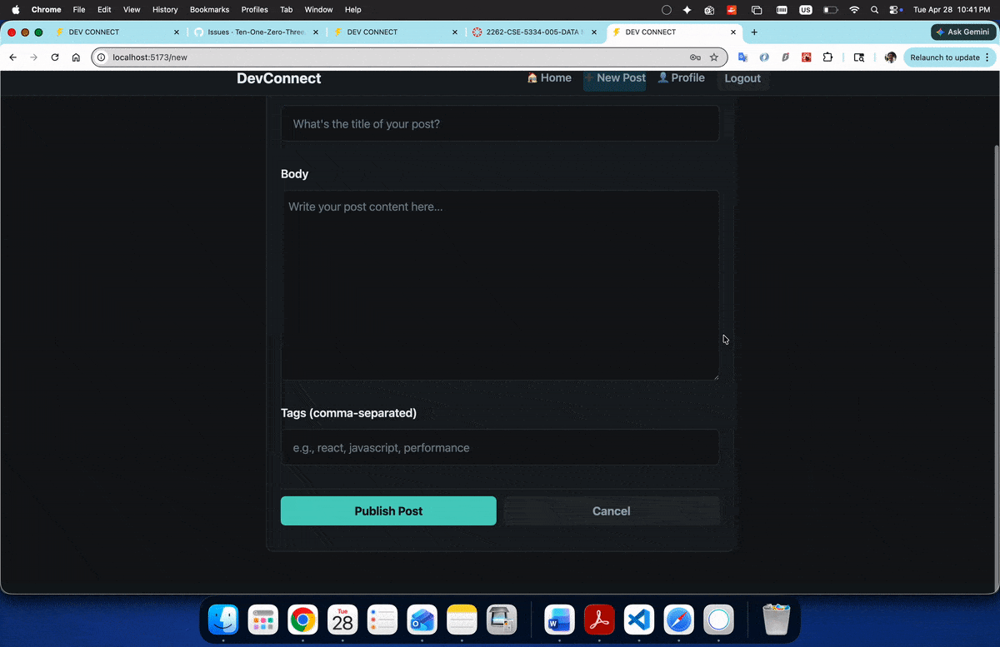
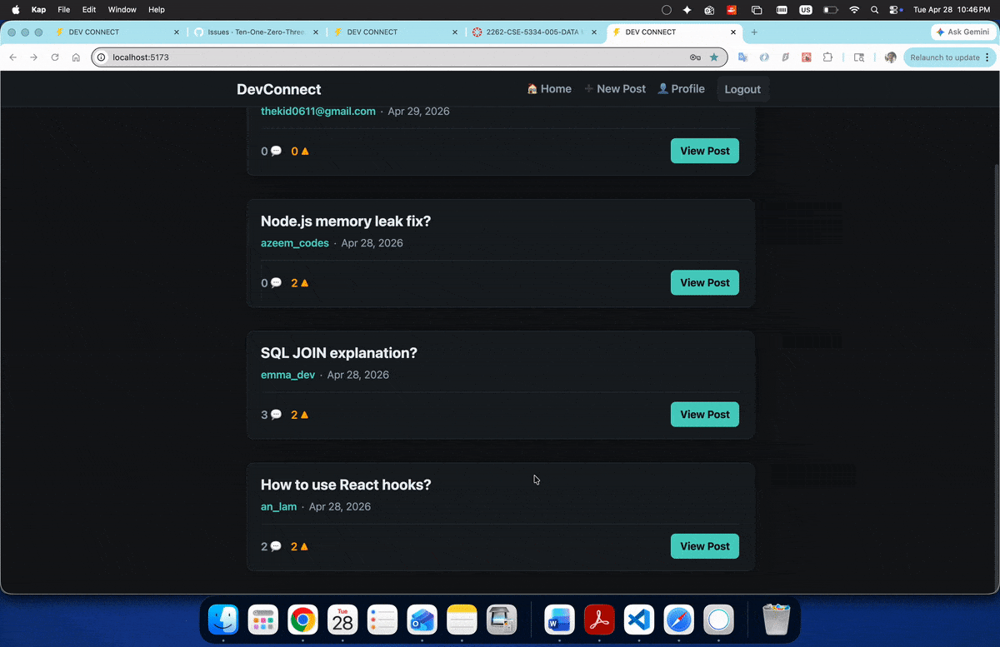
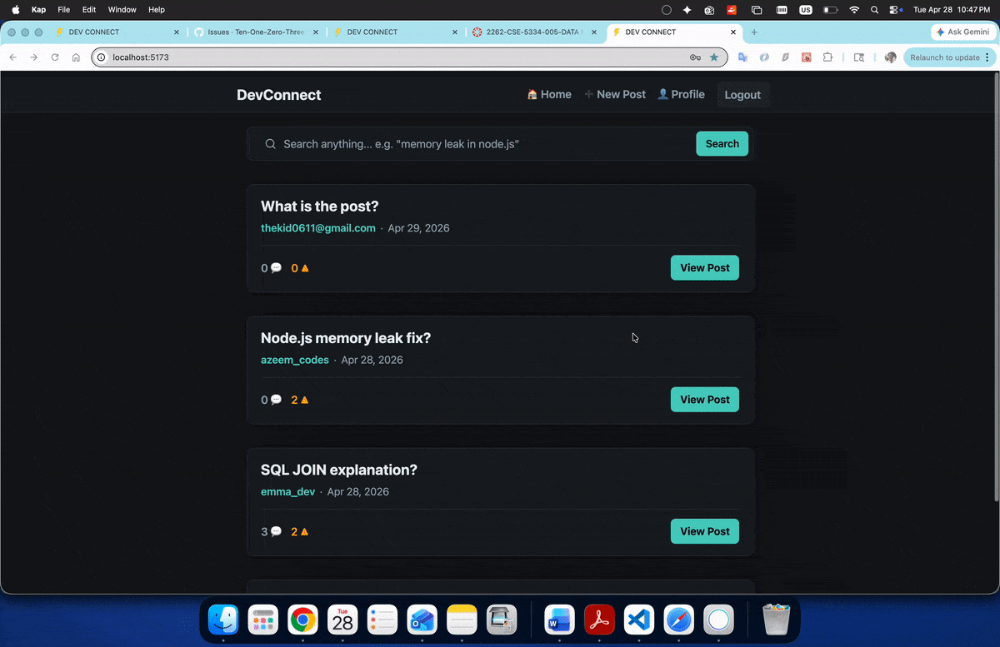
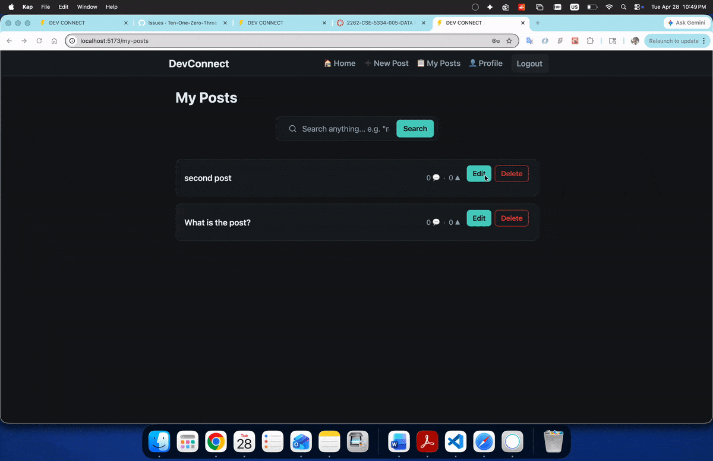
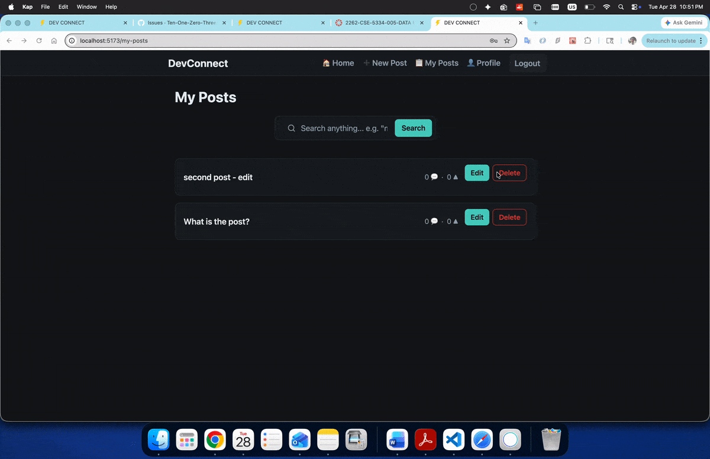

# [DevConnect]

CodePath WEB103 Final Project

Designed and developed by:
- An Lam  
- Emmanuel Enenta  
- Azeem Ibrahim  


🔗 Link to deployed app:

## About

### Description and Purpose 
DevConnect is a community driven platform where developers can share ideas, ask questions, and collaborate on projects. Users can create posts, interact through comments, and discover relevant content using tags and filters.

The purpose of this app is to provide a simple yet powerful environment for developers to connect, learn, and grow together.

### Inspiration

DevConnect is inspired by platforms like Reddit and LinkedIn, combining the open discussion style of Reddit with the professional and networking aspects of LinkedIn.

## Tech Stack

Frontend:
- React
- React Router
- CSS

Backend:
- Node.js
- Express
- PostgreSQL

## Features
### [Login and Register - Authentication] ✅ 
   User can register an account
   User can login into account
   User can logout
   User is given JWT tokent for session log in.
   

### [Create Post] ✅ 

Users can create new posts by providing a title and content to share ideas or ask questions.



### [View All Posts] ✅ 

Users can browse all posts on the homepage in a clean and organized layout.



### [View Single Post] ✅ 
Users can click on a post to view its full details along with comments.



### [Edit Post] ✅ 
Users can update their existing posts to fix errors or add new information.


### [Delete Post] ✅ 
Users can remove posts they no longer want to keep.



### [ADDITIONAL FEATURES GO HERE - ADD ALL FEATURES HERE IN THE FORMAT ABOVE; you will check these off and add gifs as you complete them]

### [Comment on Posts and comment on comment] ✅ 
Users can engage with others by adding comments to posts.


### [Upvote Posts] ✅ 
Users can upvote posts to highlight useful or popular content.
upvote.gif

### [Filter Posts by Tags]
Users can filter posts based on tags to find relevant topics quickly.

### [Sort Posts] 
Users can sort posts by newest or most upvoted.

### [Modal for Creating Posts (Custom Feature)]
Users can create posts through a popup modal without leaving the current page.

## Installation Instructions

1. Clone the repository:
   ```bash
   git clone https://github.com/Ten-One-Zero-Three/devconnect.git
   ```
