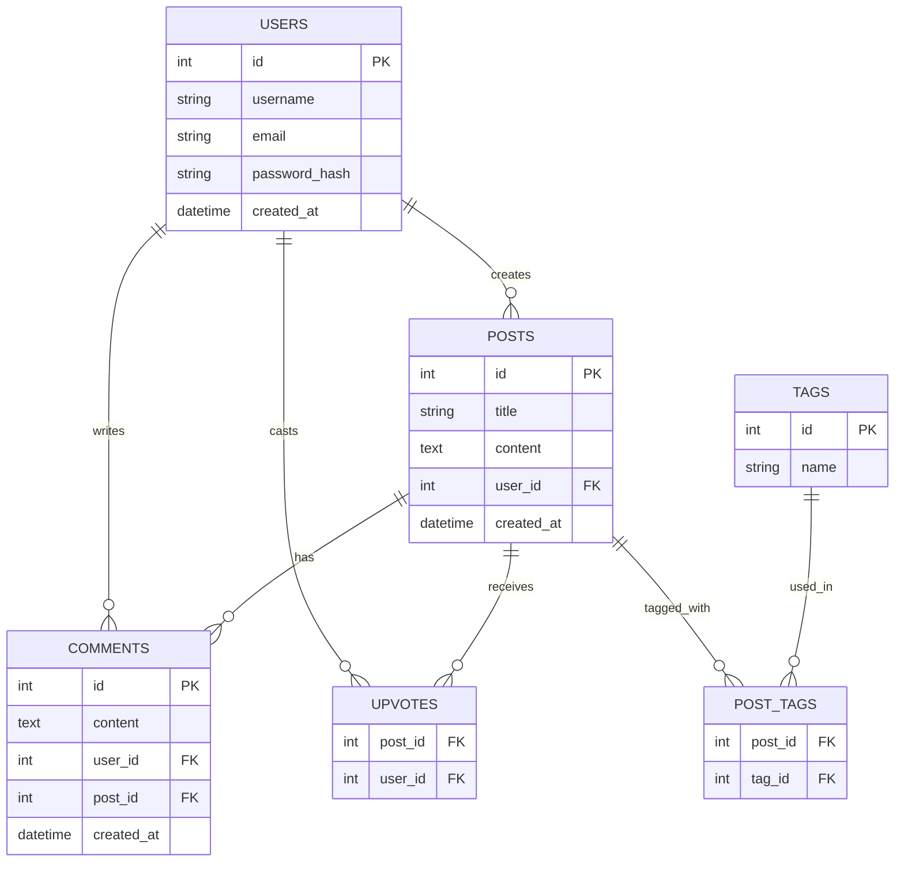

# Entity Relationship Diagram

## List of Tables

- **users** — registered accounts
- **posts** — questions or topics created by users
- **comments** — replies attached to a post
- **tags** — labels for categorizing posts
- **post_tags** — join table linking posts to tags (many-to-many)
- **upvotes** — tracks which user upvoted which post

---

## Entity Relationship Diagram

---

## Table Details

### users

| Column Name   | Type     | Description                        |
|---------------|----------|------------------------------------|
| id            | integer  | primary key, auto-increment        |
| username      | text     | unique display name                |
| email         | text     | unique, used for login             |
| password_hash | text     | hashed password                    |
| created_at    | datetime | account creation timestamp         |

### posts

| Column Name | Type     | Description                          |
|-------------|----------|--------------------------------------|
| id          | integer  | primary key, auto-increment          |
| title       | text     | question or post headline            |
| content     | text     | full body of the post                |
| user_id     | integer  | FK → users.id (author)               |
| created_at  | datetime | post creation timestamp              |

### comments

| Column Name | Type     | Description                          |
|-------------|----------|--------------------------------------|
| id          | integer  | primary key, auto-increment          |
| content     | text     | comment body                         |
| user_id     | integer  | FK → users.id (author)               |
| post_id     | integer  | FK → posts.id (parent post)          |
| created_at  | datetime | comment creation timestamp           |

### tags

| Column Name | Type    | Description                     |
|-------------|---------|---------------------------------|
| id          | integer | primary key, auto-increment     |
| name        | text    | tag label (e.g. "javascript")   |

### post_tags

| Column Name | Type    | Description           |
|-------------|---------|-----------------------|
| post_id     | integer | FK → posts.id         |
| tag_id      | integer | FK → tags.id          |

### upvotes

| Column Name | Type    | Description           |
|-------------|---------|-----------------------|
| post_id     | integer | FK → posts.id         |
| user_id     | integer | FK → users.id         |

---

## Key Relationships

1. **User → Posts (1:N)** — one user can create many posts
2. **User → Comments (1:N)** — one user can write many comments
3. **Post → Comments (1:N)** — one post can have many comments
4. **Post ↔ Tags (M:N)** — a post can have multiple tags; a tag can appear on multiple posts (via `post_tags`)
5. **Post → Upvotes (1:N)** — a post can receive upvotes from many users; each user can upvote a post once
